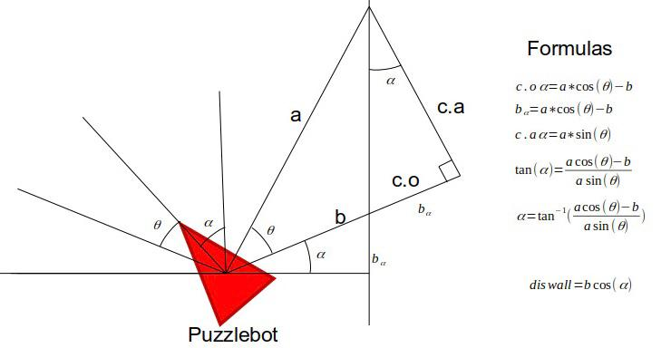
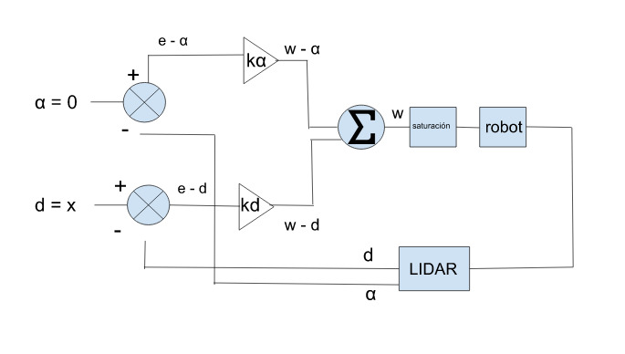

# PuzzlebotWallFollower

- Leonardo Gracida Munoz A01379812
- Daniel Fuentes Castro A01750425
- Santiago Ortiz Suzarte A01750402

Este codigo corre un Wall Follower Utilizando el robot Modelo Puzzlebot de Manchester Robotics utilziando un LIDAR.

- Seutilizo el siguiente modelo geometrico para obtener el angulo de inclinación de robot cofnrme al muro, como también la distancia perpendicular del robot con el muro: <br>

<br>

- Se utilzo el siguiente sistema de control para maneter el robot alineado como también a una distancia deseada al muro:<br>

<br>

alfa es el angulo de inclinacion y d es la distancia deseada hacia el muro.
- El abanico del LIDAR va de -pi/2 a pi/2.
- Los comandos para correr la simulación son: (Estos comandos deben ser corridos en la terminal en la carpeta catkin_ws)
```
source devel/setup.bash
```
```
roslaunch puzzlebot_gazebo puzzlebot_room.launch
```
```
rosrun puzzlebot_nav2d right_hand_rule_template.py 
```
- Todo corre con ROS Melodic en Ubuntu 18.04
- El archivo que contiene el codigo documentado de la implemetnación esta en catkin_ws/src/puzzlebot_nav2d/src/right_hand_rule_template.py


